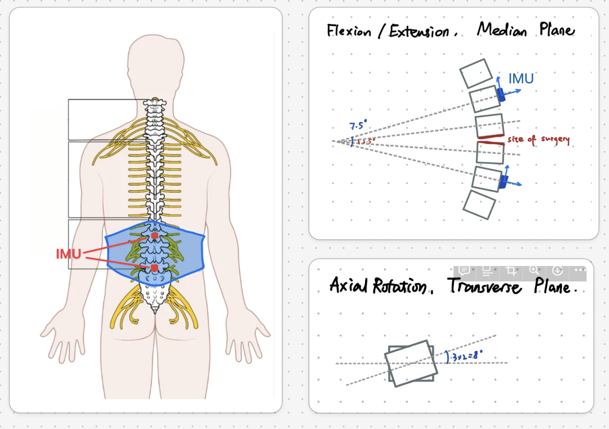
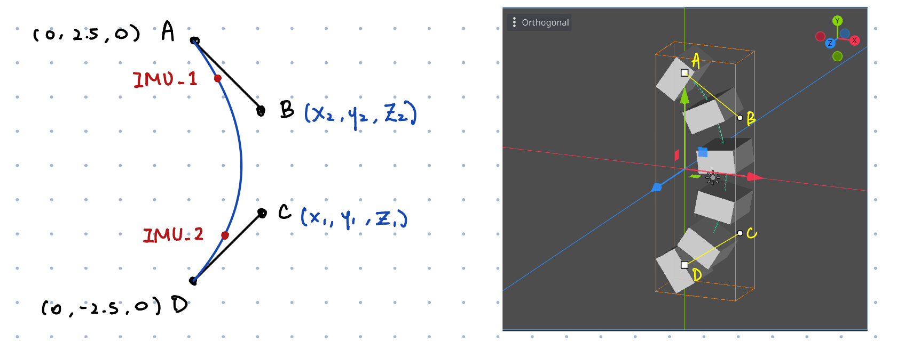
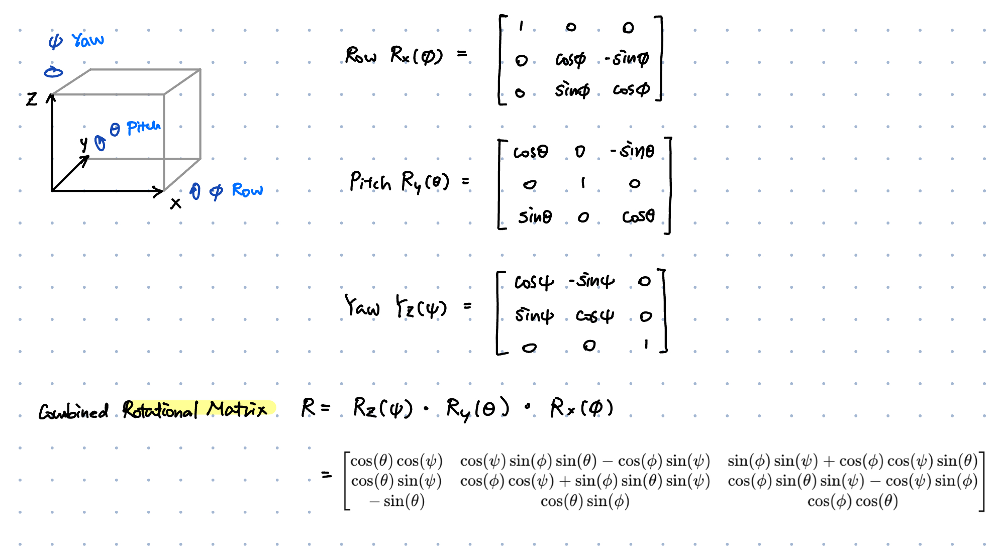
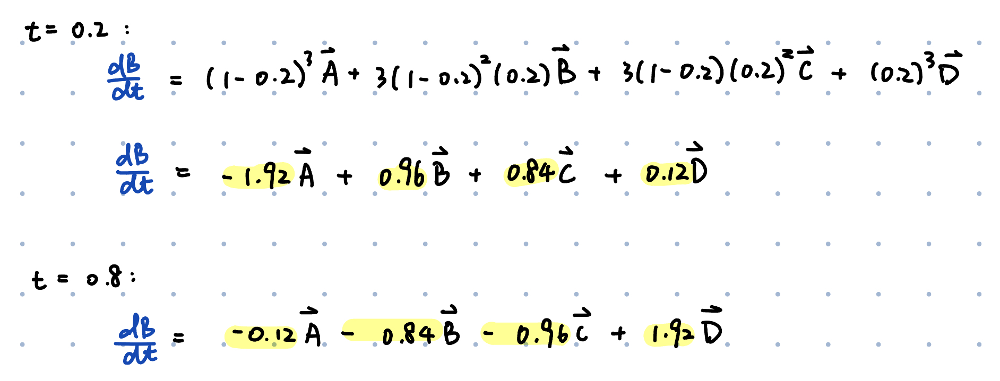
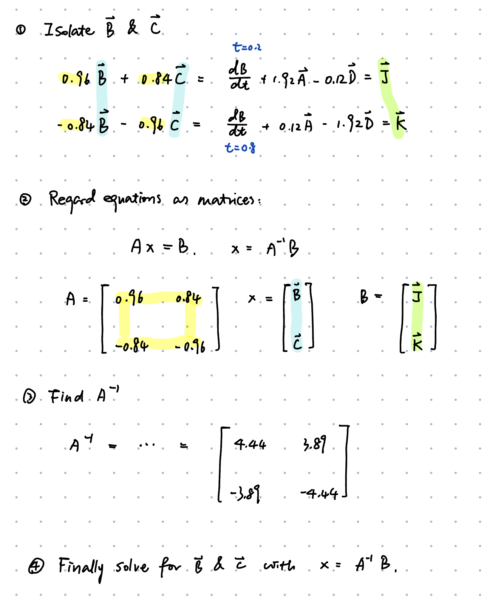
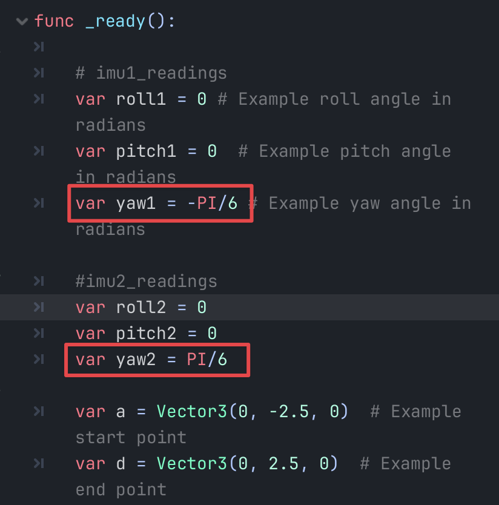

# Wearable Sensor for Spine Movement

## General Information about this Project
- **Goal:** Using two `IMU sensors` (in red) placed on the spine to monitor the spinal motion and curvature.

    


- We've done some previous work to have the IMU sensors measure the rotational angles on the `x`, `y`, `z` axis. The angles of rotation are called roll, pitch, yaw, respectfully.

    
    

## Simulating the Spine Curve

### 0. Some Background Knowledge -- Bezier Curve

- **What it is:** Parametric Curves defined by a set of **control points**
- **How the curves are drawn:**
    - 3 control points in 2D:

        

    - 4 control points in 2D:

        

- **Mathematical Definition:**

    - The general formula of Bézier curve $\mathbf{B}(t)$ is given by:

        $$\mathbf{B}(t) = \sum_{i=0}^{n} \binom{n}{i} (1 - t)^{n-i} t^i \mathbf{P}_i$$
        
        where t describes the position of the points along the curve, range from 0 to 1.

    - The formula can be expanded as:

        $$\mathbf{B}(t) = (1 - t)^n \mathbf{P}_0 + \binom{n}{1} (1 - t)^{n-1} t \mathbf{P}_1 + \cdots + \binom{n}{n-1} (1 - t) t^{n-1} \mathbf{P}_{n-1} + t^n \mathbf{P}_n, \quad 0 \leq t \leq 1$$
        
    - The derivative:
        
        $$\mathbf{B}'(t) = n \sum_{i=0}^{n-1} b_{i,n-1}(t) (\mathbf{P}_{i+1} - \mathbf{P}_i), \quad 0 \leq t \leq 1$$
        

### 1. Defining Our Problem Space

- We aim to simulate the curvature of the spine based on IMU readings.

    <span style="color:red">
    Uncertainty 1: I thought that we would have enough information to draw a 4-point Bezier curve yet this might not be true. If this turns out to be causing the issue, I would gladly turn the order of the curve to 3-points.
    </span>


- For simplification, we treat the selected spine segment as a curved path defined by **four** control points: `A`, `B`, `C`, and `D`, with IMUs placed at positions corresponding to 20% and 80% along the path.
    ```
    t1 = 0.2, t2 = 0.8
    ```

    

- We define the start and end points of the path, `A` and `D`, which gives us two points to start with. Then, we work backwards using properties derived from the IMU readings to determine the coordinates of the intermediate control points `B` and `C`. 

- To summerize the given and unknowns:

    - Given: 
        1. The IMU readings `roll, pitch, yaw` at two positions along the curve.
        2. The distances or relative positions of the IMUs (20% and 80% along the curve).
        3. The coordinates of the start and end points, `A` and `D`. 
            - (the coordinates can be anything, I just happened to be picking `(0, 2.5, 0)` and `(0, -2.5,0)` for simplicity of graphing, we can change this)
    - To find: The coordinates of the intermediate control points `B` and `C`.

## 2. Thought Process in Solving the Problem

- For a 4-point Bezier Curve with points, $ \mathbf n=4 $, the equation with respect to the four points `A`, `B`, `C`,`D` is given by:

    $$\mathbf{B}(t) = (1-t)^3\mathbf{A}+3(1-t)^2t\mathbf{B}+3(1-t)t^2\mathbf{C}+t^3\mathbf{D},\ 0 \le t \le 1$$

    with derivative:

    
    $$\frac{d\mathbf{B}}{dt} = -3(1 - t)^2 \mathbf{A} + 3(1 - t)(1 - 3t) \mathbf{B} + 3t(2 - 3t) \mathbf{C} + 3t^2 \mathbf{D} \ \ \ \ \ \ \ \ \ \ \ \ \ \ \ \ \ \ \ \  (*)$$
    

- Here, `A` and `D` are known. 
- If we are able to get $\frac{d\mathbf{B}}{dt}$ at $\mathbf t=0.2, t=0.8$ through the row, pitch, yaw angles provided by the two IMUs, then the only unknowns we are left with will be `B`, and `C`. 
- We should then be able to solve the problem by solving the two quadratic equations at $\mathbf t=0.2, t=0.8$

    <span style="color:red">
    Uncertainty 2: The assumption made in here was that the row, pitch, yaw angles we got from the IMU sensors will give us enough information to construct dB/dt, yet this might be false. 
    </span>

## 3. Current Attempt / Work in Solving the Problem
### step 1: Turning roll, pitch, yaw angles from each sensor into $\frac{d\mathbf{B}}{dt}$
1. Construct a rotational matrix from the elementry rotation on each idividual axis
    

2. Multiple the rotation matrix with a basis vector:

    ```math
    \mathbf{v}_{\text{rotated}} = R \cdot \mathbf{v},\ \ \
    v = \begin{bmatrix}
    1 \\
    0 \\
    0
    \end{bmatrix}
    ```
   
4. I then used $\mathbf{v}_{\text{rotated}}$ as the gradient vector $\frac {d\mathbf{B}}{dt}$

    <span style="color:red">
    Uncertainty 3: I'm aware that this step may be wrong but I don't know how to fix it: the roll, pitch, yaw angles gives only the direction of the gradient vector but not the magnitude. I tried normalizing the gradient vector got from this step and use it as dB/dt, but it did't work out and made no logical sense.
    </span>

### step 2: Solving for B and C knowing A, D, $\frac{d\mathbf{B}}{dt}$
1. pluged in $t = 0.2$ and $t=0.8$ into equation $(*)$

    

2. Solved B and C using matrices:

    


## 4. Current (irrational) Results
- right now, when I test my code by setting the roll, pitch, yaw angles as shown in the picture:

    

    the gradient vector $\frac {d\mathbf{B}}{dt}$ I got for t = 0.2 and 0.8 are:

    

    the final answer calculated for vector `B` and `C` are:

    

    - This answer is way off, because given the start point and end point, the y-axis value for `B` and `C` should be within [-2.5, 2.5].
